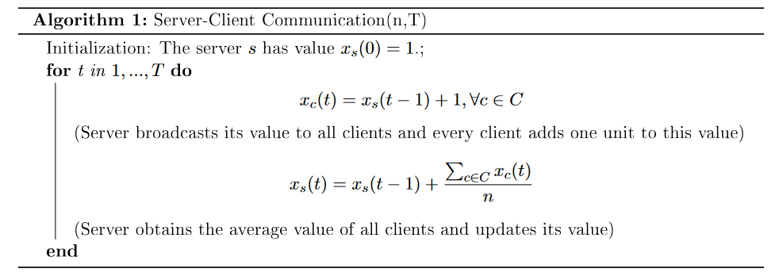

# Pytorch distributed package
## Start
- Book two cores in NEF cluster
- Clone the directory `git clone https://gitlab.inria.fr/chxu/pytorch_exercice.git`
- Enter into the "distributed" directory
- Activate your conda environment
- Execute the code `torchrun --nnodes=1 --nproc-per-node=2 launch.py`

## Tasks
0. Read the [backend description](https://pytorch.org/docs/stable/distributed.html) for the torch.distributed package and see what kind of collective communication is supported.
1. Check the code of launch.py, what are the functions to get the rank of the process and the number of all processes?
2. Check the code of send_message.py. Try to launch the code using "torchrun". The example code achieves what kind of communication?
3. Run the code of broadcast.py  and reduce.py with --nproc-per-node=4. Understand the collective communication done by the code.
   - How to modify the code of broadcast.py that the rank 0 broadcast to all the others
   - From the result of reduce.py, can you see which algorithm is used?

## Exercice
4. Code the following algorithm
Suppose that there are n + 1 processes that rank 0 is considered as the server and the
others are considered as the clients. Try to use the collective communication operation.

{width=600 height=700}